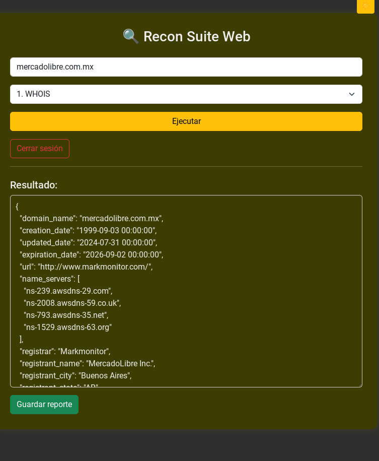

# 🔍 Recon6_Suite

Recon6_Suite es una herramienta de reconocimiento web desarrollada en Python con Flask. Está diseñada para centralizar funciones esenciales de pentesting y análisis OSINT en una interfaz sencilla, visualmente atractiva y funcional. Ideal para tareas de recolección de información en pruebas de seguridad.

---

## 🧰 Funcionalidades Principales

- ✅ WHOIS Lookup  
- ✅ Escaneo DNS (con dnsdumpster)  
- ✅ Escaneo de puertos con Nmap  
- ✅ Detección de tecnologías web  
- ✅ Extracción de correos desde un sitio web  
- ✅ Búsqueda de subdominios  
- ✅ Interfaz web responsiva con Bootstrap  
- ✅ Panel en colores amarillos y diseño amigable

---

## 🖼️ Captura de pantalla

  

---

## 🎥 Demo

  

---

## 🚀 Instalación

### Requisitos:
- Python 3.8 o superior
- Git
- pip

### Clonación del repositorio:
git clone https://github.com/Alex976925/Recon6_suite.git
cd Recon6_suite
pip install -r requirements.txt
python app.py

---

🙌 ¿Te fue útil esta herramienta?

Si deseas apoyar este proyecto y motivar el desarrollo de más herramientas de ciberseguridad, puedes hacerlo con una donación:

  

---
